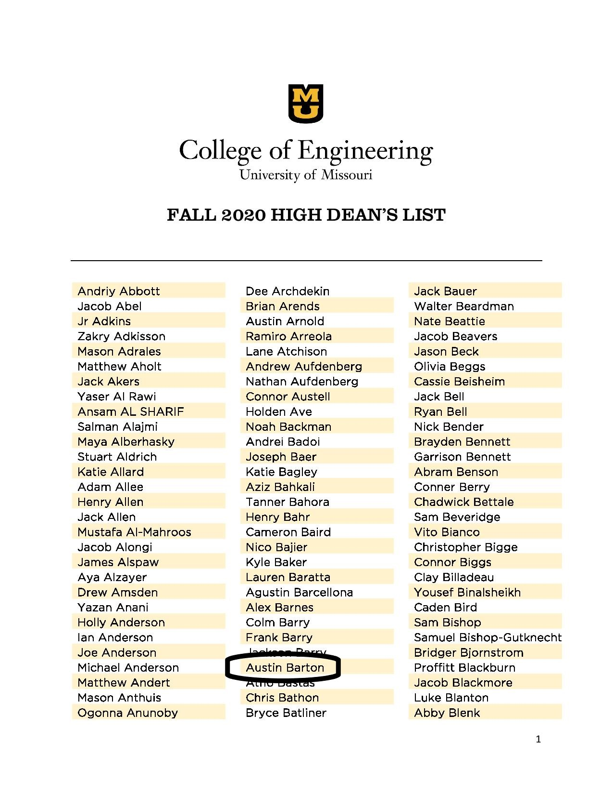

<!---
Austin Barton
IT 1000
-->
# Academic Performance

## My Courses for Spring 2021:

| Class | Description | Credits | Grade |
| ------- |:-------:| ----- | ---- |
| ECONOM 1015 | PRNCPLS MACROECONOMICS | 3 | A- |
| AGSC_COM 3210W | FUNDAMNTLS OF COMMUNIC - WI | 3 | A- |
| INFOTC 1000 | INTRO INFO TECH | 3 | A+ |
| INFOTC 1040 | INTRO PROB SOLVE & PROGR | 3 | A |
| MANGMT 3300 | INTR BUSN PRCSS & TECHNL | 3 | A- |
| MANGMT 3540 | INTRO TO BUSINESS LAW | 3 | B+ |

## My Courses for Fall 2021:

| Class | Description | Credits |
| ------- |:-------:| -----|
| ACCTCY 2036 | ACCOUNTING 1 | 3 |
| BUS_AD 2500 | NTERMEDIATE PROF DEV PRINCPLS | 2 |
| INFOTC 2040 | PROG LANG & PARA | 3 |
| INFOTC 2810 | FUND OF NETWORK TECHNLGY | 3 |
| INFOTC 4401 | PYTHON 1 | 3 |

## Achievements

[Home Page](./README.md)
